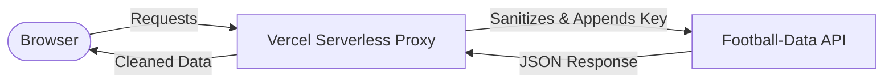

<!-- markdownlint-disable MD033 -->
<div align="center">
  
  <br />
  
  
  
  
</div>
<!-- markdownlint-enable MD033 -->

# Master Course: Dynamic Ligue 1 Dashboard

Welcome to the **complete chronological handbook** for the Ligue 1 Dashboard project. This project is not just a dashboard—it is a live demonstration of the **AI-Assisted Coding** philosophy. It shows how an AI developer (Antigravity) orchestrates the entire lifecycle of a tech product: from market framing and UI audit to fullstack development and industrial deployment.

---

## Technical Core

| Layer | Implementation |
|---|---|
| **Philosophy** |  |
| **Interface** |   |
| **Security** |  |
| **Data Engine** |  |

---

## I. Strategic Framing

Every project begins with a clear **Intention**. We refused "Feature Creep" and defined a strict MVP scope to ensure a premium delivery within record time. This phase is crucial as it sets the boundaries for the AI and the developer.

### 1. Project Specifications
We established our guardrails in the [projet.md](docs/I.%20Cadrage%20strat%C3%A9gique/projet.md) file. This document acts as the "Contract" between the strategy and the execution.

> **Excerpt from projet.md:**
> *Objective: Develop a production-ready dashboard for French Ligue 1.*
> *Context: Use high-density data visualization to provide immediate KPI insights for sports analysts.*
> *Platform: Single Page Application (SPA) with real-time API integration.*

> [!IMPORTANT]
> **MVP Scope Definition**: 
> - Single view experience (no sub-pages).
> - High-density KPIs for instant reading.
> - Dynamic Standings Table with real-time API binding.
> - 4 Key Statistical Visualizations (Bar charts & Histograms).
> - **Zero** complex navigation to maintain speed and focus.

### 2. Strategic Deliverable
All the strategic research was synthesized into a visual framing document that allows the team to align on the final product vision before any code is written — a one-pager summarizing scope, KPIs, and product vision (see below).

<div align="center">
  
</div>

---

## II. Visual Audit: The FootX Benchmark

To avoid a "generic" or "empty" feel, we audited **FootX.fr**, a gold standard in professional sports data visualization. We captured 5 key views to teach our AI the specific "Data DNA" of French football.

**Step 2.1: Analyzing the Landing Hierarchy**
The landing page audit helps us understand how to greet the user with immediate, high-value information; the screenshot shows the FootX landing page — hierarchy and placement of main KPIs and navigation.
<div align="center">
  
</div>

**Step 2.2: Auditing Data-Dense Tables**
Football fans crave density. We studied how FootX handles the Ligue 1 table to replicate its efficient use of horizontal space — compact, data-dense layout for the standings (screenshot below).
<div align="center">
  
</div>

**Step 2.3: Balancing Results & Performance**
We observed how recent match results are displayed with high contrast, ensuring that scores are the most visible element; the FootX results block shows recent matches with clear score emphasis and team identities.
<div align="center">
  
</div>

**Step 2.4: Managing Upcoming Match Rhythm**
The upcoming schedule requires a "cleaner" look. We noted the use of team crests and timing info — see the FootX upcoming matches layout below.
<div align="center">
  
</div>

**Step 2.5: Deep Analytical Components**
Finally, we looked at advanced stats and "Value Picks" to see how to integrate secondary data without cluttering the main view; the FootX data/analytics view keeps advanced stats and value picks without overwhelming the screen.
<div align="center">
  
</div>

### Engineering the UI Prompt
We didn't just tell the AI to "make it dark." We provided an exhaustive audit prompt to extract specific tokens. 

> **Excerpt from prompt_design.md:**
> *"You are a Senior UI/UX Designer. Audit the provided screenshots of FootX.fr. Extract the following: Primary Background HEX, Surface Card HEX, Border Radius scaled in PX, and Font Stack hierarchy. Output a JSON design system."*

> [!TIP]
> **Mega-Prompt Restoration**: The full design audit prompt is saved in [prompt_design.md](docs/II.%20Cr%C3%A9ations%20graphiques/prompt_design.md). It instructs the AI to sample HEX codes, border radii, and spacing scales directly from the benchmark images.

**Step 2.6: The AI Design Analysis**
The AI processes the benchmark images and outputs a structured set of design rules — prompt and output (colors, radii, typography) derived from the FootX benchmarks (screenshot below).
<div align="center">
  
</div>

### The Final Design System
The result is [theme.md](docs/II.%20Cr%C3%A9ations%20graphiques/theme.md), which serves as our visual constitution.

> **Excerpt from theme.md:**
> *--primary-green: #00E676;*
> *--dark-bg: #0B0D10;*
> *Font: 'Inter', sans-serif;*
> *Border-radius: 12px;*

---

## III. Data Infrastructure & API Validation

The dashboard is "Live-Mocked": it uses real production data from the **football-data.org (v4)** API.

> **Excerpt from architecture.md:**
> *Mapping UI components to API collections:*
> *- Standing Table -> /v4/competitions/FL1/standings*
> *- Match History -> /v4/competitions/FL1/matches*
> *- Team Metadata -> /v4/competitions/FL1/teams*

### Step-by-Step API Setup

**Step 3.1: Discovering the Provider**
We started by exploring the official provider website to understand the data availability for Ligue 1 (football-data.org branding — official source for the API, see below).
<div align="center">
  
</div>

**Step 3.2: Accessing the API Portal**
Navigating to the main developer portal to review the Quickstart guide and integration requirements — API portal landing (screenshot below).
<div align="center">
  
</div>

**Step 3.3: Account Registration**
Creating a developer account to obtain a unique `X-Auth-Token` (registration form below).
<div align="center">
  
</div>

**Step 3.4: Reviewing Usage Plans**
Auditing the "Free Tier" limitations: the 10 calls/min limit requires a smart caching strategy (pricing and quotas screenshot below).
<div align="center">
  
</div>

**Step 3.5: Accessing the Developer Profile**
Verifying the email and unlocking the personal dashboard for key management (developer profile — confirm email and access the key, see below).
<div align="center">
  
</div>

**Step 3.6: Securing the API Key**
The final step of the setup is retrieving the `API_KEY` that will be used in our secure proxy — copy the token and store it in Vercel env (never in client code; screenshot below).
<div align="center">
  
</div>

**Step 3.7: Logging Into the Developer Portal**
Once registered, you log in to access the documentation and your API key from the same interface (login screen below).
<div align="center">
  
</div>

**Step 3.8: Consulting the API Documentation**
The provider offers a clear reference for all endpoints, parameters, and response shapes—essential before writing any integration code (API documentation screenshot below).
<div align="center">
  
</div>

---

## IV. Postman Validation Suite

Before writing a single line of code, we validated every JSON structure. This "Postman First" strategy ensures that our data models are 100% accurate.

### Step-by-Step Validation

**Step 4.1: Locating the Official Collection**
We found the official Postman collection provided by the API team to speed up our testing (link or import from the API docs; screenshot below).
<div align="center">
  
</div>

**Step 4.2: Importing the Environment**
We imported the collection into our local Postman workspace to begin customization (import step — ready to set variables and run requests; see below).
<div align="center">
  
</div>

**Step 4.3: Configuring Variables**
Setting the base URL and authentication headers to enable automated testing across all endpoints (base URL and X-Auth-Token; screenshot below).
<div align="center">
  
</div>

**Step 4.4: Testing Competition Metadata**
Verifying that we can correctly retrieve the Ligue 1 name, season, and current matchday (GET competition response below).
<div align="center">
  
</div>

**Step 4.5: Validating Standings & Statistics**
Ensuring the "Table" endpoint returns positions, points, and goal differences for all 18 teams (GET standings — full table below).
<div align="center">
  
</div>

**Step 4.6: Auditing Technical Assets**
Confirming that team crests (logos) are provided as valid URLs that our frontend can display (GET teams — squad list and crest URLs; screenshot below).
<div align="center">
  
</div>

**Step 4.7: Exporting Production JSON Samples**
We saved the live responses into local JSON files to build a "Static Mock" and enable offline development.

```json
/* Sample from standings_FL1.json */
{
  "competition": { "name": "Ligue 1", "code": "FL1" },
  "season": { "startDate": "2025-08-17", "currentMatchday": 22 },
  "standings": [
    {
      "type": "TOTAL",
      "table": [
        { "position": 1, "team": { "name": "Paris Saint-Germain FC" }, "points": 54 },
        { "position": 2, "team": { "name": "Olympique de Marseille" }, "points": 48 }
      ]
    }
  ]
}
```

Check all exported samples here: [postman/samples/](docs/III.%20Architecture%20%26%20API/postman/samples/)

---

## V. Technical Blueprint

We established the architecture using a decoupled client-proxy model to ensure security and performance.

### Request Flow Diagram (Mermaid)



### The Visual Mapping
We mapped every UI block to its respective API collection as defined in our [architecture.md](docs/III.%20Architecture%20%26%20API/architecture.md) — which endpoint feeds which component (standings, matches, teams; blueprint below).

<div align="center">
  
</div>

---

## VI. Context Engineering: Scaffolding

We didn't just write files; we built a project structure that is "AI-Transparent," providing full clarity to the coding agent.

### Project Arborescence
```text
dashboard/
├── api/             # Vercel Secure Proxy (Node.js)
├── docs/            # Master Knowledge Base
├── public/          # Production UI
│   ├── app.js       # Data Hydration Engine
│   ├── index.html   # Semantic Structure
│   └── style.css    # Sport-Tech CSS System
└── server.js        # Local Dev Node Server
```

### The Scaffolding Prompts
To build this, we provided the AI with two massive logic injections.

**Step 6.1: Injecting Architecture Rules**
> **Excerpt from data.md:**
> *"You are a Senior Data Architect. Map the /v4/competitions/FL1/matches endpoint to the MatchCard component. Ensure the 'status' field is parsed to show 'Live' for IN_PLAY matches."*

Instructions for mapping API to components and parsing status (mega-prompt screenshot below).
<div align="center">
  
</div>

**Step 6.2: Injecting Data Mapping Rules**
> **Excerpt from technical_spec.md:**
> *"The SPA must handle 10 API calls per minute. Implement an aggressive LocalStorage cache on the /standings endpoint with a 300s TTL."*

Caching, rate limits, and data handling rules for the SPA (data logic mega-prompt below).
<div align="center">
  
</div>

---

## VII. Build Implementation & Vibecoding

Phase 7 is where the dashboard is **built and run**: we define the three core code artifacts (proxy, data engine, CSS), then we show **how** they were produced during a **vibecoding** session with **Antigravity** (Microsoft’s AI coding agent). Code first, then the session that generated it.

---

### 7.1 Code Artifacts (What We Build)

**7.1.1 — Secure API Proxy (`api/proxy.js`)**  
The secret `API_KEY` lives in environment variables; a Node runtime forwards requests and avoids CORS while keeping credentials server-side.

```javascript
/* Secure Backend Proxy Logic */
export default async function handler(req, res) {
    const { endpoint } = req.query;
    const API_KEY = process.env.API_KEY; // Managed by Vercel
    const response = await fetch(`https://api.football-data.org/v4${endpoint}`, {
        headers: { 'X-Auth-Token': API_KEY }
    });
    const data = await response.json();
    res.status(200).json(data);
}
```

**7.1.2 — Data Engine (`public/app.js`)**  
A single entry point fetches standings and matches on load, then fills the dashboard (KPIs, table, charts).

```javascript
/* High-Density Hydration Engine */
async function loadDashboard() {
    const standingsData = await apiFetch('/competitions/FL1/standings');
    const matchesData = await apiFetch('/competitions/FL1/matches?season=2025');
    
    renderKPIs(standingsData, matchesData);
    renderTable(standingsData);
    renderCharts(standingsData, matchesData);
}
```

**7.1.3 — Design Tokens (`public/style.css`)**  
[theme.md](docs/II.%20Cr%C3%A9ations%20graphiques/theme.md) is applied via CSS custom properties so colors and spacing stay consistent.

```css
:root {
  --bg-primary: #0B0D10;
  --surface-1: #161A1F;
  --accent-primary: #00E676; /* The iconic Ligue 1 Green */
}

/* Dense Data Table Style */
.standings-table {
  width: 100%;
  background: var(--surface-1);
  border-collapse: collapse;
}
```

---

### 7.2 Vibecoding Session (How We Built It with Antigravity)

The following screenshots document the **Antigravity** workflow from first launch to a running dashboard—so you can reproduce or adapt the flow.

**7.2.1 — Welcome & Onboarding**  
First contact with the agent: landing (entry point to the AI coding environment), welcome screen (agent's role and how to start a project), and onboarding flow (initial setup and preferences). Screenshots below.
<div align="center">
  
</div>

<div align="center">
  
</div>

<div align="center">
  
</div>

**7.2.2 — Project Setup & Context Loading**  
Create a new project and load the strategy/context so the agent follows the same specs (architecture, data, design): new project creation, loading context (docs, architecture, theme) so the LLM stays aligned, and download/setup step for dependencies. Screenshots below.
<div align="center">
  
</div>

<div align="center">
  
</div>

<div align="center">
  
</div>

**7.2.3 — Prompting & Execution**  
Guiding the agent with clear instructions and running the app locally: prompting with concrete tasks (e.g. implement proxy, wire data), launching the Node dev server, reloading the window or preview after changes, and handling the typical "localhost not found" moment (port or server not ready). Screenshots below.
<div align="center">
  
</div>

<div align="center">
  
</div>

<div align="center">
  
</div>

<div align="center">
  
</div>

**7.2.4 — Code Complete & Final Results**  
Agent has generated and wired the code; the app runs and the deliverable is visible — code completion (proxy, app.js, CSS in place) and final result (Ligue 1 dashboard running locally, ready for deployment). Screenshots below.
<div align="center">
  
</div>

<div align="center">
  
</div>

---

## VIII. Final Delivery & Deployment

The transition from a local development environment to a live, production-grade application is the final milestone of the AI-orchestrated lifecycle.

### Prerequisite: Installing Git
To sync with GitHub and deploy, you need Git on your machine. Download the installer from the official site and follow the wizard (download page and installer wizard below).
<div align="center">
  
</div>

<div align="center">
  
</div>

### 8.1. GitHub: Version Control & Remote Sync
Once you are satisfied with your implementation, synchronize your local workspace with the remote repository so every line of code and documentation is versioned.

**Step 8.1.1: Sign up and land on GitHub**  
Create an account if needed, then land on the GitHub dashboard (screenshots below).
<div align="center">
  
</div>

<div align="center">
  
</div>

**Step 8.1.2: Create a new repository**  
Name the repo (e.g. dashboard), set visibility, optional README; then you get an empty repo ready for first push (screenshots below).
<div align="center">
  
</div>

<div align="center">
  
</div>

**Step 8.1.3: Push your code and confirm**  
Run `git add .`, `git commit -m "feat: finalize dashboard specs"`, and `git push origin main`. Below: GitHub dashboard, repo after push, and sync workflow.
> **Instruction**: Run `git add .`, `git commit -m "feat: finalize dashboard specs"`, and `git push origin main` to sync your project.

<div align="center">
  
</div>

<div align="center">
  
</div>

<div align="center">
  
</div>

### 8.2. Vercel: Production Deployment
With your code on GitHub, use Vercel to host the app and get a public URL, with the secure proxy and API key managed via environment variables.

**Step 8.2.1: Register and land on Vercel**  
Sign up with GitHub, then land on the Vercel dashboard to add a new project (screenshots below).
<div align="center">
  
</div>

<div align="center">
  
</div>

**Step 8.2.2: Create a new project and first deploy**  
Import from GitHub, select the dashboard repo; first deploy may fail until env vars are set, then add API_KEY and deploy again (screenshots below).
<div align="center">
  
</div>

<div align="center">
  
</div>

<div align="center">
  
</div>

**Step 8.2.3: Configure API key and environment**  
In the project dashboard, open environment variables, add API_KEY (football-data.org key), then redeploy. Below: project dashboard, env list, and add-env flow.
<div align="center">
  
</div>

<div align="center">
  
</div>

<div align="center">
  
</div>

<div align="center">
  
</div>

### 8.3. Final Results: And Voilà!
The project is now live — final deliverable view of the Ligue 1 dashboard in production (below).

<div align="center">
  
</div>

---

## 🏆 Mission Accomplished!

Congratulations! Your **Ligue 1 Dashboard** is fully operational and production-ready.

**Live Demo**: [https://dashboard-one-wheat-33.vercel.app/](https://dashboard-one-wheat-33.vercel.app/)

*This master course demonstrates the peak of AI-orchestrated development. From strategy to production, you have successfully navigated the AI-Assisted workflow.*

