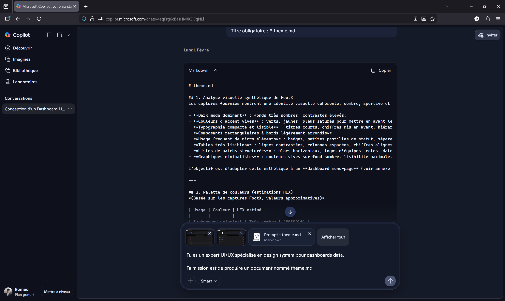
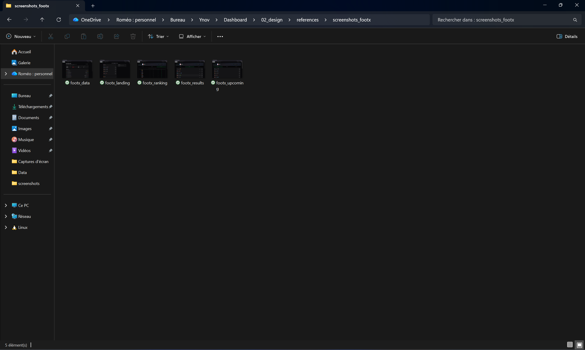
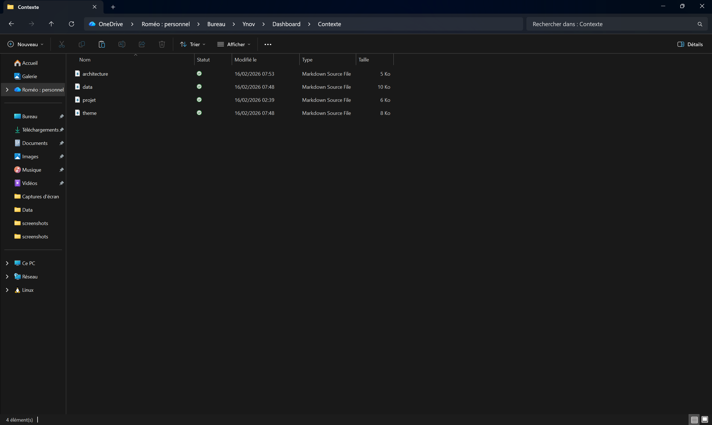

<!-- markdownlint-disable MD033 -->
<div align="center">
  
</div>
<!-- markdownlint-enable MD033 -->

# Cas d'usage : Créer un tableau de bord dynamique avec la Vibe Coding

Dans ce cas d'usage, nous allons créer un tableau de bord dynamique qui affiche les scores de la **Ligue 1** de football en récupérant les données auprès d'une API. Comme pour les précédents cas d'usage, nous allons procéder étape par étape et utiliser un nouvel outil : **Antigravity de Google**.

<!-- markdownlint-disable MD033 -->
<div align="center">
  
</div>
<!-- markdownlint-enable MD033 -->

---

## Préambule

Avant de détailler chacune des étapes de la conception et de la création de ce tableau de bord, il nous semble essentiel de préciser plusieurs points :

- **Les modèles et chatbots évoluent très régulièrement.** Tout ce qui est présenté dans cette capsule est susceptible d'avoir changé lorsque vous parcourrez ce tutoriel.
- **Le Vibe Coding est avant tout une philosophie.** Cette pratique correspond à des besoins ponctuels ou du prototypage rapide (MVP).
- **Chaque demande génère une réponse différente.** L'important est l'échange productif avec le chatbot.

---

## Cadrage du projet

Nous commençons par définir un cadre général en utilisant **Gemini**.

### Étape 1 : Rédaction du Mega-Prompt de Cadrage
Nous demandons à Gemini de formuler un prompt complet pour rédiger nos spécifications :

> Tu es un développeur sénior spécialisé dans la conception et la création de tableaux de bord de données. Tu dois m'aider à formuler un **mega-prompt** pour rédiger le document de spécifications de mon projet : un tableau de bord en ligne qui affiche les résultats de la Ligue 1 de football français.

### Étape 2 : Le Mega-Prompt de Spécification
Le chatbot génère alors le mega-prompt suivant, que nous exécutons pour obtenir notre fichier `projet.md` :

```markdown
# Rôle
Tu es un chef de produit sénior spécialisé dans la conception et la création de tableaux de bord de données.
Ta mission est de produire un document de spécification nommé "projet.md".
```

### Étape 3 : Résultat du Cadrage (`projet.md`)
Le document `projet.md` définit les checklists et la structure visuelle.

```markdown
# 7. Structure visuelle (schéma layout)
---------------------------------------------------------
| HEADER COMPÉTITION                                     |
---------------------------------------------------------
| KPIs GLOBAUX                                          |
---------------------------------------------------------
| CLASSEMENT GÉNÉRAL                                    |
---------------------------------------------------------
| VISUALISATIONS (Bar Charts & Histogramme)             |
---------------------------------------------------------
```

---

## Définition d'une intention graphique

Nous cherchons maintenant à spécifier les éléments graphiques en nous inspirant de **FootX.fr**.

### Mega-Prompt UI/UX
Nous demandons à l'IA d'analyser l'esthétique "Sport-Tech" à partir de captures d'écran :

> Tu es un expert UI/UX. Ta mission est de produire un document nommé "theme.md" en t'inspirant du look & feel de FootX.fr.

### Synthèse Visuelle (`theme.md`)
L'analyse identifie les codes suivants :
- **Dark mode dominant** : Background anthracite (`#0B0D10`).
- **Accents saturés** : Vert néon (`#00E676`).




---

## Choix et validation de la source de données

Nous utilisons l'API de **football-data.org**. 

### Étape 1 : Création du compte et Récupération de l'API Key
Nous nous inscrivons pour obtenir notre `X-Auth-Token`.

<div align="center">
  
  
</div>

<div align="center">
  
  
</div>

### Étape 2 : Test de l'API avec Postman
Nous importons la collection officielle pour valider les endpoints `standings` et `matches`.

<div align="center">
  
  
</div>

**Test de l'endpoint Standings :**
<div align="center">
  
</div>

---

## Rédaction des spécifications techniques

Nous demandons à Gemini de rédiger le document `data.md` et `architecture.md`.



### Schéma d'Architecture (ASCII)
```text
┌─────────────────────────────────────────────────────┐
│  1. HEADER (Nom · Saison · Logo)                    │
├─────────────────────────────────────────────────────┤
│  2. KPIs ([Équipes] [Matchs] [Buts] [Moy.] [Journ.]) │
└─────────────────────────────────────────────────────┘
```

---

## Génération du code avec Antigravity

Nous importons toute notre documentation (les captures d'écran, les fichiers MD et les samples JSON) dans Antigravity.

### Le Mega-Prompt de Build
> **MISSION** : Produis un fichier "plan.md" et un pack Node ultra simple pour tester en local. Utilise les captures d'écran du site de référence (FootX) et les samples JSON pour mapper les données.

### Extraits du Code Généré

**Le Proxy API (`api/proxy.js`) :**
```javascript
export default async function handler(req, res) {
    const { endpoint } = req.query;
    const API_KEY = process.env.API_KEY;
    const response = await fetch(`https://api.football-data.org/v4${endpoint}`, {
        headers: { 'X-Auth-Token': API_KEY }
    });
    const data = await response.json();
    res.status(200).json(data);
}
```

---

## Déploiement et Mise en ligne

### 1. Versionnage sur GitHub
Nous lions le projet local à un repository distant.

### 2. Mise en ligne sur Vercel
Nous importons le projet GitHub sur Vercel et configurons la variable d'environnement `API_KEY`. 

<div align="center">
  
</div>

**Félicitations ! Votre application est maintenant publique.**

---

<p align="center">
  <i>"Football Data, Refined by Vibe Coding."</i>
</p>
