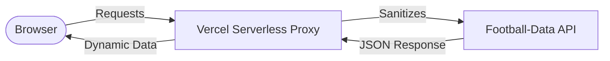

<div align="center">
  
  
  
  
</div>

<br />

<!-- markdownlint-disable MD033 -->
<div align="center">
  
</div>
<!-- markdownlint-enable MD033 -->

# Master Course: Dynamic Ligue 1 Dashboard

Welcome to the **complete chronological handbook** for the Ligue 1 Dashboard project. This project is not just a dashboard—it is a live demonstration of the **Vibe Coding** philosophy. It shows how an AI developer (Antigravity) orchestrates the entire lifecycle of a tech product: from market framing and UI audit to fullstack development and industrial deployment.

---

## Technical Core

| Layer | Implementation |
|---|---|
| **Philosophy** | AI-First (Vibe Coding) |
| **Interface** | Vanilla JavaScript & Modular CSS |
| **Security** | Vercel Serverless Proxy |
| **Data** | Football-Data.org API (v4) |

---

## 1. Strategic Framing (Phase 1)

Every project begins with a clear **Intention**. We refused "Feature Creep" and defined a strict MVP scope to ensure a premium delivery within record time.

### The Source of Truth: `projet.md`
We established our guardrails in [projet.md](docs/I. Cadrage stratégique/projet.md). 
The goal: **"A single-page, high-density dashboard for Ligue 1."**

**Strategic Deliverable**
This document summarizes the market positioning and the functional blocks recognized by the AI.
<div align="center">
  
</div>

---

## 2. Visual Audit: The FootX Benchmark (Phase 2)

To avoid a "generic" feel, we audited **FootX.fr**, a gold standard in sports data visualization. We captured 5 key views to teach our AI the specific "Data DNA" of French football.

**Ref A: Landing Experience Hierarchy**
<div align="center">
  
</div>

**Ref B: Data-Dense Ranking Table**
<div align="center">
  
</div>

**Ref C: Scoring & Result Density**
<div align="center">
  
</div>

**Ref D: Matchday Schedule Rhythm**
<div align="center">
  
</div>

**Ref E: Advanced Analytical Blocks**
<div align="center">
  
</div>

### Engineering the UI Prompt
We didn't just tell the AI to "make it dark." We provided an exhaustive audit prompt.

> [!TIP]
> **Mega-Prompt Restoration**: The full design audit prompt is saved in [prompt_design.md](docs/II. Créations graphiques/prompt_design.md). It instructs the AI to sample HEX codes and spacing scales directly from the benchmark images.

**AI Processing View**
<div align="center">
  
</div>

### The Final Design Tokens
The result is [theme.md](docs/II. Créations graphiques/theme.md), our visual constitution.

<div align="center">
  
</div>

---

## 3. Data Infrastructure & API Validation (Phase 3)

The dashboard is "Live-Mocked": it uses real production data from **football-data.org (v4)**.

**API Provider Exploration**
<div align="center">
  
</div>

**Step-by-Step API Setup**
<div align="center">
  
</div>

<div align="center">
  
</div>

<div align="center">
  
</div>

<div align="center">
  
</div>

> [!IMPORTANT]
> **Quota Warning**: The free tier allows **10 calls/min**. Our [architecture.md](docs/III. Architecture & API/architecture.md) implements a strict caching strategy to avoid API lockouts.

---

## 4. Postman Validation Suite (Phase 4)

Before coding, we validated every single JSON structure. This is the **"Postman First"** strategy.

**Importing the Collection**
<div align="center">
  
  
</div>

**Exhaustive Connectivity Tests**
<div align="center">
  
</div>

<div align="center">
  
</div>

<div align="center">
  
</div>

**Exporting Production JSON Samples**
We saved the live responses to build an offline data layer.
[View Mock Data Folder](mock/)

<div align="center">
  
</div>

---

## 5. Technical Blueprint (Phase 5)

We established the architecture using a decoupled client-proxy model.

### Request Flow Diagram (Mermaid)



### The Visual Blueprint
Mapping UI components to API collections as defined in [architecture.md](docs/III. Architecture & API/architecture.md).

<div align="center">
  
</div>

---

## 6. Context Engineering: Scaffolding (Phase 6)

We didn't just start writing files. We built a project structure that is "AI-Transparent."

### Project Arborescence
```text
dashboard/
├── api/             # Vercel Secure Proxy (Node.js)
├── docs/            # Master Knowledge Base
├── mock/            # Local JSON Mock Samples
├── public/          # Production UI
│   ├── app.js       # Data Hydration Engine
│   ├── index.html   # Semantic Structure
│   └── style.css    # Sport-Tech CSS System
└── server.js        # Local Dev Node Server
```

### The Scaffolding Prompts
To build this, we provided the AI with two massive logic injections.

**Prompt A: Architecture Injection**
<div align="center">
  
</div>

**Prompt B: Data Mapping Injection**
<div align="center">
  
</div>

---

## 7. Build Implementation (Phase 7)

### Step 1: Secure API Proxy (`api/proxy.js`)
We hid the secret `API_KEY` in environment variables and created a Node runtime to bypass CORS and secure the key.

```javascript
// Restoration of the Secure Proxy Logic
export default async function handler(req, res) {
    const { endpoint } = req.query;
    const API_KEY = process.env.API_KEY; // Managed by Vercel
    const response = await fetch(`https://api.football-data.org/v4${endpoint}`, {
        headers: { 'X-Auth-Token': API_KEY }
    });
    const data = await response.json();
    res.status(200).json(data);
}
```

### Step 2: The UI Engine (`public/app.js`)
We built a custom engine to map the complex JSON response to our HTML cards.

```javascript
/* Data Hydration Logic */
async function loadDashboard() {
    const standingsData = await apiFetch('/competitions/FL1/standings');
    const matchesData = await apiFetch('/competitions/FL1/matches?season=2025');
    
    document.getElementById('standings-table').innerHTML = renderTable(standingsData);
    document.getElementById('kpi-container').innerHTML = renderKPIs(standingsData, matchesData);
}
```

### Step 3: Dark Mode Design System (`public/style.css`)
We implemented the [theme.md](docs/II. Créations graphiques/theme.md) tokens using CSS custom properties.

```css
:root {
  --bg-primary: #0B0D10;
  --surface-1: #161A1F;
  --accent-primary: #00E676; /* Ligue 1 Green */
}

body { background-color: var(--bg-primary); }
.card { background-color: var(--surface-1); border: 1px solid #2a2f36; }
```

---

## 8. Final Delivery & Deployment

The result is a fully functional, high-density football dashboard.

<div align="center">
  
</div>

### Deployment Monitoring
The project is live, synchronized with a private GitHub repository for CI/CD.

<div align="center">
  
  
</div>

---

<p align="center">
  <i>"Football Data, Defined by Strategy, Pushed by Vibe." — Course Documented by Antigravity.</i>
</p>
