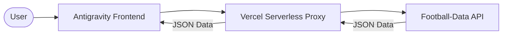

<!-- markdownlint-disable MD033 -->
<div align="center">
  
</div>
<!-- markdownlint-enable MD033 -->

# Case Study: Dynamic Ligue 1 Dashboard (Vibe Coding)

This document is the **complete chronological handbook** for the Ligue 1 Dashboard project. It traces every iteration, from strategic framing to final deployment, including data analysis and interface design. This project was developed following the **Vibe Coding** philosophy, orchestrated by AI via **Antigravity** tools.

---

## Technical Overview

| Category | Technology Stack |
|---|---|
| **Frontend** | Vanilla JS, CSS3, HTML5 |
| **Backend** | Node.js (Vercel Serverless Functions) |
| **Data Source** | [football-data.org](https://api.football-data.org/v4) |
| **Philosophy** | AI-First Development (Vibe Coding) |

---

## 1. Strategic Framing

The framing phase defines the scope of our **MVP** (Most Valuable Product). The goal is to create a single-page, dark-themed dashboard focused on data visualization for the French football league.

> [!IMPORTANT]
> The "Vibe" is about maintaining a tight scope. In this project, we explicitly refused any feature creep (no player-specific pages, no betting integration) to focus on the core "Standing-to-Visuals" experience.

### The Specification Document
The [projet.md](docs/I. Cadrage stratégique/projet.md) file serves as our source of truth. It defines:
- **Scope**: Single view (Hero, KPIs, Standings, Stats).
- **Goal**: Real-time league feeling.

---

## 2. Visual Identity Design (UI/UX)

We opted for a **Sport-Tech Dark** aesthetic inspired by the reference site FootX.fr.

### Reference Analysis
We analyzed FootX's interfaces to extract its DNA: density, high contrast, and information hierarchy.

<div align="center">
  
</div>

<div align="center">
  
</div>

> [!TIP]
> **Aesthetic Tip**: When analyzing a reference site, look at the "negative space." FootX uses tight margins to create a "dense data" feeling that appeals to sports fans.

### Visual Validation
Our final design theme sets the HEX codes: Background `#0B0D10`, Accents `#00E676` (Neon Green).

<div align="center">
  
</div>

<div align="center">
  
</div>

Source: [theme.md](docs/II. Créations graphiques/theme.md)

---

## 3. Data Exploration & Validation (API)

The project relies entirely on the [football-data.org](https://api.football-data.org/v4) API.

### The API Portal
We started with the Quickstart to understand authentication methods.

<div align="center">
  
</div>

<div align="center">
  
</div>

### Registration & Profile
Obtaining an `X-Auth-Token` is the mandatory first step.

<div align="center">
  
</div>

<div align="center">
  
</div>

> [!CAUTION]
> **API Limits**: The Free Tier allows only 10 requests per minute. Efficient caching is not just an optimization; it's a requirement to avoid 429 Errors.

### Postman Testing
Before any coding, we validated the real JSON structures.

<div align="center">
  
</div>

**JSON Sample Extraction**
<div align="center">
  
</div>

Check source samples: [competition_FL1.json](docs/III. Architecture & API/postman/samples/competition_FL1.json), [standings_FL1.json](docs/III. Architecture & API/postman/samples/standings_FL1.json).

---

## 4. Technical Architecture

Our architecture is built on a classic client-server model with an **API Proxy** to hide the secret key.

### Flow Diagram (Mermaid)



### Technical Mapping
The [architecture.md](docs/III. Architecture & API/architecture.md) document formalizes how API fields map to UI components.

<div align="center">
  
</div>

---

## 5. Context Engineering & Scaffolding

We scaffolded the project to provide structural context to the AI before writing logic.

> [!NOTE]
> Scaffolding is the "Skeleton" of Vibe Coding. It ensures the AI doesn't hallucinate a file structure that doesn't exist.

### Project Directory Tree
The [create_structure.sh](docs/IV. Context Engineering/Arborescence/create_structure.sh) script generated:

```text
dashboard/
├── api/             # Serverless Proxy Functions
├── docs/            # Knowledge Base (MD + PNGs)
├── mock/            # Local Test Data
├── public/          # Static Site Root
└── server.js        # Local Dev Server
```

---

## 6. Vibe Coding Build Process

### Phase 1: The API Proxy (`api/proxy.js`)
The proxy handles the `fetch` request using the secure `process.env.API_KEY`.

```javascript
// [Source Link](api/proxy.js)
export default async function handler(req, res) {
    const { endpoint } = req.query;
    const API_KEY = process.env.API_KEY;
    const response = await fetch(`https://api.football-data.org/v4${endpoint}`, {
        headers: { 'X-Auth-Token': API_KEY }
    });
    const data = await response.json();
    res.status(200).json(data);
}
```

### Phase 2: UI Implementation (`public/`)
Applying the [theme.md](docs/II. Créations graphiques/theme.md) tokens to create a dense, high-contrast interface.

### Phase 3: Data Fetching Engine (`public/app.js`)
The engine maps JSON keys (like `team.crest`) to DOM elements.

> [!TIP]
> **Coding Tip**: Always use a fallback image for team crests. Some third-party SVGs might fail to load; use the Ligue 1 logo as a default.

### Final Result
The fully functional, dynamic Ligue 1 Dashboard.

<div align="center">
  
</div>

---

<p align="center">
  <i>Project documented by Antigravity — Strategy by Vibe Coding.</i>
</p>
