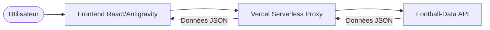

<!-- markdownlint-disable MD033 -->
<div align="center">
  
</div>
<!-- markdownlint-enable MD033 -->

# Étude de Cas : Dashboard Dynamique Ligue 1 (Vibe Coding)

Ce document constitue le **manuel complet et chronologique** du projet Dashboard Ligue 1. Il retrace chaque itération, du cadrage stratégique au déploiement final, en passant par l'analyse de données et la conception d'interface. Ce projet a été réalisé selon la philosophie du **Vibe Coding**, orchestré par l'IA via les outils **Antigravity**.

---

## Sommaire

1. [Cadrage Stratégique](#1-cadrage-stratégique)
2. [Conception Graphique (UI/UX)](#2-conception-graphique-uiux)
3. [Exploration et Validation des Données (API)](#3-exploration-et-validation-des-données-api)
4. [Architecture Technique](#4-architecture-technique)
5. [Context Engineering et Arborescence](#5-context-engineering-et-arborescence)
6. [Vibe Coding : Le Processus de Build](#6-vibe-coding--le-processus-de-build)

---

## 1. Cadrage Stratégique

La phase de cadrage définit le périmètre de notre Produit Minimum Viable (**MVP**). L'objectif est de créer un tableau de bord mono-page, sombre, axé sur la data-visualisation pour la compétition française de football.

### Le Document de Spécification
Le fichier [projet.md](docs/I. Cadrage stratégique/projet.md) définit les piliers du projet :
- **Périmètre** : Vue unique (Hero, KPIs, Classement, Stats).
- **Source** : API football-data.org (FL1).
- **Contrainte** : Aucun élargissement fonctionnel (pas de page équipe/joueur).

> [!NOTE]
> Les fondations du projet reposent sur une structure sémantique claire, documentée dans le dossier [I. Cadrage stratégique](docs/I. Cadrage stratégique/).

---

## 2. Conception Graphique (UI/UX)

Nous avons choisi une esthétique **Sport-Tech Dark** inspirée du site de référence FootX.fr.

### Analyse de la Référence
Nous avons scruté les interfaces de FootX pour en extraire les codes : densité, contrastes et hiérarchie de l'information.

<div align="center">
  
</div>

<div align="center">
  
</div>

<div align="center">
  
</div>

### Le Prompt de Design de Référence
Pour traduire ces visuels en code, nous avons soumis les captures à l'IA avec le prompt suivant :

> *Tu es un expert UI/UX. Analyse ces 5 captures du site FootX. Identifie les codes couleurs exacts, les espacements, le style des cartes et la typographie. Produis un document theme.md regroupant tous les design tokens.*

<div align="center">
  
</div>

### Livrable Graphique
La synthèse visuelle définit nos tokens : Background `#0B0D10`, Accents `#00E676` (Neon Green).

<div align="center">
  
</div>

Source : [theme.md](docs/II. Créations graphiques/theme.md)

---

## 3. Exploration et Validation des Données (API)

Le projet repose entièrement sur l'API [football-data.org](https://api.football-data.org/v4).

### Le Portail API
Nous avons commencé par le Quickstart pour comprendre les méthodes d'authentification.

<div align="center">
  
</div>

<div align="center">
  
</div>

### Enregistrement et Accès
La création d'un compte est l'étape indispensable pour obtenir un `X-Auth-Token`.

<div align="center">
  
</div>

<div align="center">
  
</div>

### Gestion de la Clé API
La clé est extraite et sera stockée de manière sécurisée dans nos variables d'environnement.

<div align="center">
  
</div>

### Étude des Limites et de la Documentation
Nous validons les quotas (10 calls/min) et les endpoints via la documentation officielle.

<div align="center">
  
</div>

<div align="center">
  
</div>

### Tests avec Postman
Pour chaque endpoint, nous validons la structure des données réelles.

<div align="center">
  
</div>

<div align="center">
  
</div>

<div align="center">
  
</div>

**Test de l'endpoint Compétition**
<div align="center">
  
</div>

**Test de l'endpoint Classement (Standings)**
<div align="center">
  
</div>

**Exportation des Samples JSON**
Une fois les tests validés, nous exportons les réponses pour guider le développement local.
<div align="center">
  
</div>

Consultez les fichiers sources : [competition_FL1.json](docs/III. Architecture & API/postman/samples/competition_FL1.json), [standings_FL1.json](docs/III. Architecture & API/postman/samples/standings_FL1.json).

---

## 4. Architecture Technique

Notre architecture est bâtie sur un modèle client-serveur classique avec un **Proxy API** pour protéger la clé secrète.

### Schéma de Flux (Mermaid)



### Le Livrable d'Architecture
Le document [architecture.md](docs/III. Architecture & API/architecture.md) formalise le mapping entre les champs API et les composants UI.

<div align="center">
  
</div>

---

## 5. Context Engineering et Arborescence

Avant d'écrire la moindre ligne de code, nous avons "scaffoldé" le projet pour donner un contexte structurel à l'IA.

### Arborescence du Projet
Le script [create_structure.sh](docs/IV. Context Engineering/Arborescence/create_structure.sh) a généré la structure suivante :

```text
dashboard/
├── api/             # Fonctions Serverless (Proxy)
├── docs/            # Base de connaissances (MD + Images)
├── mock/            # Données de test locales
├── public/          # Racine du site statique
└── server.js        # Serveur de développement local
```

### Les Mega-Prompts de Contextualisation
Nous avons soumis deux prompts massifs à l'IA pour définir la logique métier.

**Prompt Architecture :**
<div align="center">
  
</div>

**Prompt Data Management :**
<div align="center">
  
</div>

Source : [MarkDowns/technical_spec.md](docs/IV. Context Engineering/Contexte/MarkDowns/technical_spec.md)

---

## 6. Vibe Coding : Le Processus de Build

L'exécution s'est déroulée en trois phases d'écriture prioritaires.

### Phase 1 : Le Proxy API (`api/proxy.js`)
Le proxy permet d'appeler l'API sans exposer le `X-Auth-Token` côté client.

```javascript
// [Lien vers source](api/proxy.js)
export default async function handler(req, res) {
    const { endpoint } = req.query;
    const API_KEY = process.env.API_KEY;
    const response = await fetch(`https://api.football-data.org/v4${endpoint}`, {
        headers: { 'X-Auth-Token': API_KEY }
    });
    const data = await response.json();
    res.status(200).json(data);
}
```

### Phase 2 : Le Squelette HTML & CSS (`public/`)
Nous avons appliqué les tokens du [theme.md](docs/II. Créations graphiques/theme.md) pour créer une interface sombre et dense.

### Phase 3 : La Logique de Fetch (`public/app.js`)
Le frontend consomme le proxy et mappe les données JSON sur les composants de visualisation.

```javascript
// Extrait du mapping Standings
function renderStandings(table) {
  const container = document.getElementById('standings-table');
  container.innerHTML = table.map(row => `
    <tr>
      <td>${row.position}</td>
      <td> ${row.team.name}</td>
      <td>${row.points}</td>
    </tr>
  `).join('');
}
```

### Livrable Final
Voici le rendu final obtenu après intégration complète dans Antigravity.

<div align="center">
  
</div>

---

<p align="center">
  <i>Projet documenté par Antigravity — Stratégie par Vibe Coding.</i>
</p>
