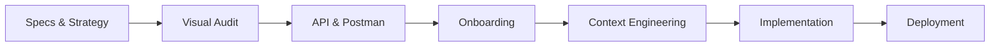

# Ligue 1 Dashboard — Documentation Index

This is the **docs folder** for the Dynamic Ligue 1 Dashboard project. It contains all strategic, visual-audit, API, context-engineering, vibecoding, and deployment assets produced during the vibecoding master course (strategy, FootX benchmark, football-data.org API & Postman, proxy architecture, and Vercel deployment).

Below you will find a simplified tree of the docs structure, the project lifecycle diagram, and a full list of every resource with clickable links.

---

## Docs tree (simplified)

```
docs/
├── I. Strategic Framing
├── II. Graphic Collections
│   ├── references/
│   │   └── screenshots_footx/
│   ├── livrable.png, prompt_design.md, prompt_design.png, theme.md
├── III. Architecture & API
│   ├── api_docs/
│   │   ├── api_quickstart_assets/
│   │   └── screenshots/
│   ├── postman/
│   │   ├── samples/
│   │   └── screenshots/
│   ├── architecture.md, data.md, github.png, livrable.png, vercel.png
├── IV. Context Engineering
│   ├── Arborescence/
│   └── Contexte/
│       └── MarkDowns/
├── V. Vibecoding
│   └── screenshots/
├── VIII. Deployment
│   ├── git/
│   ├── github/
│   └── vercel/
└── README.md
```

---

## Project lifecycle (AI-orchestrated dashboard workflow)



---

## All documentation resources

### I. Strategic Framing

| Resource | Link |
|----------|------|
| Prompts - Dashboard | [Prompts - Dashboard.docx](I.%20Strategic%20Framing/Prompts%20-%20Dashboard.docx) |
| Strategy and Concept | [Strategy and Concept.md](I.%20Strategic%20Framing/Strategy%20and%20Concept.md) |

### II. Graphic Collections

| Resource | Link |
|----------|------|
| Livrable | [livrable.png](II.%20Graphic%20Collections/livrable.png) |
| Prompt design (Markdown) | [prompt_design.md](II.%20Graphic%20Collections/prompt_design.md) |
| Prompt design (Image) | [prompt_design.png](II.%20Graphic%20Collections/prompt_design.png) |
| Theme (design system) | [theme.md](II.%20Graphic%20Collections/theme.md) |

**II. Graphic Collections / references**

| Resource | Link |
|----------|------|
| Livrable | [livrable.png](II.%20Graphic%20Collections/references/livrable.png) |

**II. Graphic Collections / references / screenshots_footx**

| Resource | Link |
|----------|------|
| FootX data | [footx_data.png](II.%20Graphic%20Collections/references/screenshots_footx/footx_data.png) |
| FootX landing | [footx_landing.png](II.%20Graphic%20Collections/references/screenshots_footx/footx_landing.png) |
| FootX ranking | [footx_ranking.png](II.%20Graphic%20Collections/references/screenshots_footx/footx_ranking.png) |
| FootX results | [footx_results.png](II.%20Graphic%20Collections/references/screenshots_footx/footx_results.png) |
| FootX upcoming | [footx_upcoming.png](II.%20Graphic%20Collections/references/screenshots_footx/footx_upcoming.png) |

### III. Architecture & API

| Resource | Link |
|----------|------|
| architecture.md | [architecture.md](III.%20Architecture%20%26%20API/architecture.md) |
| data.md | [data.md](III.%20Architecture%20%26%20API/data.md) |
| github.png | [github.png](III.%20Architecture%20%26%20API/github.png) |
| livrable.png | [livrable.png](III.%20Architecture%20%26%20API/livrable.png) |
| vercel.png | [vercel.png](III.%20Architecture%20%26%20API/vercel.png) |

**III. Architecture & API / api_docs**

| Resource | Link |
|----------|------|
| API quickstart (HTML) | [api_quickstart.htm](III.%20Architecture%20%26%20API/api_docs/api_quickstart.htm) |

**III. Architecture & API / api_docs / api_quickstart_assets**

| Resource | Link |
|----------|------|
| 308-16c9367c8810b3dd147a.js | [308-16c9367c8810b3dd147a.js](III.%20Architecture%20%26%20API/api_docs/api_quickstart_assets/308-16c9367c8810b3dd147a.js) |
| all-e4ad1110a7170b29daf6295b1f003eac.js | [all-e4ad1110a7170b29daf6295b1f003eac.js](III.%20Architecture%20%26%20API/api_docs/api_quickstart_assets/all-e4ad1110a7170b29daf6295b1f003eac.js) |
| bootstrap.min-87721e3c29de9056afe66679a29008c8.js | [bootstrap.min-87721e3c29de9056afe66679a29008c8.js](III.%20Architecture%20%26%20API/api_docs/api_quickstart_assets/bootstrap.min-87721e3c29de9056afe66679a29008c8.js) |
| bootstrap.min-92af3981f10606ab3532f7ab30c68c52.css | [bootstrap.min-92af3981f10606ab3532f7ab30c68c52.css](III.%20Architecture%20%26%20API/api_docs/api_quickstart_assets/bootstrap.min-92af3981f10606ab3532f7ab30c68c52.css) |
| chargebee.js | [chargebee.js](III.%20Architecture%20%26%20API/api_docs/api_quickstart_assets/chargebee.js) |
| jquery-3.3.1.min-316f4a4b08cacb4a8bcc0861d9dcd1d5.js | [jquery-3.3.1.min-316f4a4b08cacb4a8bcc0861d9dcd1d5.js](III.%20Architecture%20%26%20API/api_docs/api_quickstart_assets/jquery-3.3.1.min-316f4a4b08cacb4a8bcc0861d9dcd1d5.js) |
| jquery-ui.min-a102d63ca90aa3b85424cd8a5a8cdb73.js | [jquery-ui.min-a102d63ca90aa3b85424cd8a5a8cdb73.js](III.%20Architecture%20%26%20API/api_docs/api_quickstart_assets/jquery-ui.min-a102d63ca90aa3b85424cd8a5a8cdb73.js) |
| logo.jpg | [logo.jpg](III.%20Architecture%20%26%20API/api_docs/api_quickstart_assets/logo.jpg) |
| main-e239b5eb63179ba94afb1ece9ee4aaba.css | [main-e239b5eb63179ba94afb1ece9ee4aaba.css](III.%20Architecture%20%26%20API/api_docs/api_quickstart_assets/main-e239b5eb63179ba94afb1ece9ee4aaba.css) |
| main.js | [main.js](III.%20Architecture%20%26%20API/api_docs/api_quickstart_assets/main.js) |
| mobile-5cd987714c38f38c314f6328a49b0041.css | [mobile-5cd987714c38f38c314f6328a49b0041.css](III.%20Architecture%20%26%20API/api_docs/api_quickstart_assets/mobile-5cd987714c38f38c314f6328a49b0041.css) |
| modernizr-3352865027b8ec0d681ccbc484d287e3.js | [modernizr-3352865027b8ec0d681ccbc484d287e3.js](III.%20Architecture%20%26%20API/api_docs/api_quickstart_assets/modernizr-3352865027b8ec0d681ccbc484d287e3.js) |
| plausible.js | [plausible.js](III.%20Architecture%20%26%20API/api_docs/api_quickstart_assets/plausible.js) |
| style-f8cf7448205eaed9ca8612143710a6e1.css | [style-f8cf7448205eaed9ca8612143710a6e1.css](III.%20Architecture%20%26%20API/api_docs/api_quickstart_assets/style-f8cf7448205eaed9ca8612143710a6e1.css) |

**III. Architecture & API / api_docs / screenshots**

| Resource | Link |
|----------|------|
| API documentation | [api_documentation.png](III.%20Architecture%20%26%20API/api_docs/screenshots/api_documentation.png) |
| API key | [api_key.md.png](III.%20Architecture%20%26%20API/api_docs/screenshots/api_key.md.png) |
| API landing | [api_landing.png](III.%20Architecture%20%26%20API/api_docs/screenshots/api_landing.png) |
| API login | [api_login.png](III.%20Architecture%20%26%20API/api_docs/screenshots/api_login.png) |
| API Postman collection | [api_postman_collection.png](III.%20Architecture%20%26%20API/api_docs/screenshots/api_postman_collection.png) |
| API Postman collection save | [api_postman_collection_save.png](III.%20Architecture%20%26%20API/api_docs/screenshots/api_postman_collection_save.png) |
| API pricing | [api_pricing.png](III.%20Architecture%20%26%20API/api_docs/screenshots/api_pricing.png) |
| API profile | [api_profile.png](III.%20Architecture%20%26%20API/api_docs/screenshots/api_profile.png) |
| API register | [api_register.png](III.%20Architecture%20%26%20API/api_docs/screenshots/api_register.png) |

**III. Architecture & API / postman**

| Resource | Link |
|----------|------|
| Postman collection customization | [postman_collection.customization](III.%20Architecture%20%26%20API/postman/postman_collection.customization) |

**III. Architecture & API / postman / samples**

| Resource | Link |
|----------|------|
| competition_FL1.json | [competition_FL1.json](III.%20Architecture%20%26%20API/postman/samples/competition_FL1.json) |
| matches_FL1.json | [matches_FL1.json](III.%20Architecture%20%26%20API/postman/samples/matches_FL1.json) |
| standings_FL1.json | [standings_FL1.json](III.%20Architecture%20%26%20API/postman/samples/standings_FL1.json) |
| teams_FL1.json | [teams_FL1.json](III.%20Architecture%20%26%20API/postman/samples/teams_FL1.json) |

**III. Architecture & API / postman / screenshots**

| Resource | Link |
|----------|------|
| postman-api | [postman-api.png](III.%20Architecture%20%26%20API/postman/screenshots/postman-api.png) |
| postman_get_competition | [postman_get_competition.png](III.%20Architecture%20%26%20API/postman/screenshots/postman_get_competition.png) |
| postman_get_matches | [postman_get_matches.png](III.%20Architecture%20%26%20API/postman/screenshots/postman_get_matches.png) |
| postman_get_standings | [postman_get_standings.png](III.%20Architecture%20%26%20API/postman/screenshots/postman_get_standings.png) |
| postman_get_teams | [postman_get_teams.png](III.%20Architecture%20%26%20API/postman/screenshots/postman_get_teams.png) |
| postman_import | [postman_import.png](III.%20Architecture%20%26%20API/postman/screenshots/postman_import.png) |
| postman_save_json | [postman_save_json.png](III.%20Architecture%20%26%20API/postman/screenshots/postman_save_json.png) |
| postman_url | [postman_url.png](III.%20Architecture%20%26%20API/postman/screenshots/postman_url.png) |

### IV. Context Engineering

**Arborescence**

| Resource | Link |
|----------|------|
| Arborescence.md | [Arborescence.md](IV.%20Context%20Engineering/Arborescence/Arborescence.md) |
| create_structure.sh | [create_structure.sh](IV.%20Context%20Engineering/Arborescence/create_structure.sh) |

**Contexte**

| Resource | Link |
|----------|------|
| prompt_architecture.png | [prompt_architecture.png](IV.%20Context%20Engineering/Contexte/prompt_architecture.png) |
| prompt_data.png | [prompt_data.png](IV.%20Context%20Engineering/Contexte/prompt_data.png) |
| architecture.md | [architecture.md](IV.%20Context%20Engineering/Contexte/MarkDowns/architecture.md) |
| data.md | [data.md](IV.%20Context%20Engineering/Contexte/MarkDowns/data.md) |
| data_spec.md | [data_spec.md](IV.%20Context%20Engineering/Contexte/MarkDowns/data_spec.md) |
| technical_spec.md | [technical_spec.md](IV.%20Context%20Engineering/Contexte/MarkDowns/technical_spec.md) |

### V. Vibecoding

| Resource | Link |
|----------|------|
| Livrable | [Livrable.png](V.%20Vibecoding/Livrable.png) |
| plan.md | [plan.md](V.%20Vibecoding/plan.md) |

**V. Vibecoding / screenshots**

| Resource | Link |
|----------|------|
| antigravity_donwload | [antigravity_donwload.png](V.%20Vibecoding/screenshots/antigravity_donwload.png) |
| antigravity_final_results | [antigravity_final_results.png](V.%20Vibecoding/screenshots/antigravity_final_results.png) |
| antigravity_finish_code | [antigravity_finish_code.png](V.%20Vibecoding/screenshots/antigravity_finish_code.png) |
| antigravity_landing | [antigravity_landing.png](V.%20Vibecoding/screenshots/antigravity_landing.png) |
| antigravity_launch_node | [antigravity_launch_node.png](V.%20Vibecoding/screenshots/antigravity_launch_node.png) |
| antigravity_load-context | [antigravity_load-context.png](V.%20Vibecoding/screenshots/antigravity_load-context.png) |
| antigravity_localhost_not_found | [antigravity_localhost_not_found.png](V.%20Vibecoding/screenshots/antigravity_localhost_not_found.png) |
| antigravity_new_project | [antigravity_new_project.png](V.%20Vibecoding/screenshots/antigravity_new_project.png) |
| antigravity_onboarding | [antigravity_onboarding.png](V.%20Vibecoding/screenshots/antigravity_onboarding.png) |
| antigravity_prompting | [antigravity_prompting.png](V.%20Vibecoding/screenshots/antigravity_prompting.png) |
| antigravity_reload_window | [antigravity_reload_window.png](V.%20Vibecoding/screenshots/antigravity_reload_window.png) |
| antigravity_welcome | [antigravity_welcome.png](V.%20Vibecoding/screenshots/antigravity_welcome.png) |

### VIII. Deployment

**VIII. Deployment / git**

| Resource | Link |
|----------|------|
| Git download page | [git-download-page.png](VIII.%20Deployment/git/git-download-page.png) |
| Git installer wizard | [git-installer-wizard.jpg](VIII.%20Deployment/git/git-installer-wizard.jpg) |

**VIII. Deployment / github**

| Resource | Link |
|----------|------|
| GitHub create repo | [github-create-repo.png](VIII.%20Deployment/github/github-create-repo.png) |
| GitHub dashboard | [github-dashboard.png](VIII.%20Deployment/github/github-dashboard.png) |
| GitHub landing | [github-landing.png](VIII.%20Deployment/github/github-landing.png) |
| GitHub repo empty | [github-repo-empty.png](VIII.%20Deployment/github/github-repo-empty.png) |
| GitHub repo full | [github-repo-full.png](VIII.%20Deployment/github/github-repo-full.png) |
| GitHub sign-up | [github-sign-up.png](VIII.%20Deployment/github/github-sign-up.png) |

**VIII. Deployment / vercel**

| Resource | Link |
|----------|------|
| Vercel add env | [vercel_add_env.png](VIII.%20Deployment/vercel/vercel_add_env.png) |
| Vercel dashboard | [vercel_dashboard.png](VIII.%20Deployment/vercel/vercel_dashboard.png) |
| Vercel env | [vercel_env.png](VIII.%20Deployment/vercel/vercel_env.png) |
| Vercel first deploy | [vercel_first_deploy.png](VIII.%20Deployment/vercel/vercel_first_deploy.png) |
| Vercel landing | [vercel_landing.png](VIII.%20Deployment/vercel/vercel_landing.png) |
| Vercel new project | [vercel_new_project.png](VIII.%20Deployment/vercel/vercel_new_project.png) |
| Vercel register | [vercel_register.png](VIII.%20Deployment/vercel/vercel_register.png) |
| Vercel second deploy | [vercel_second_deploy.png](VIII.%20Deployment/vercel/vercel_second_deploy.png) |
